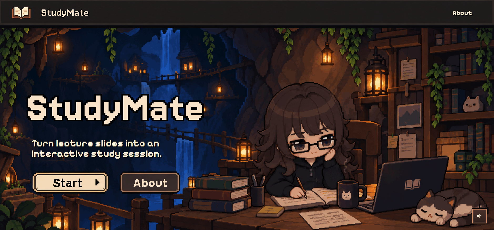
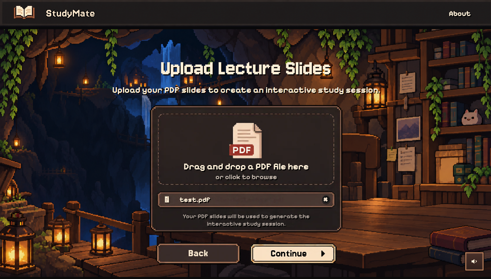
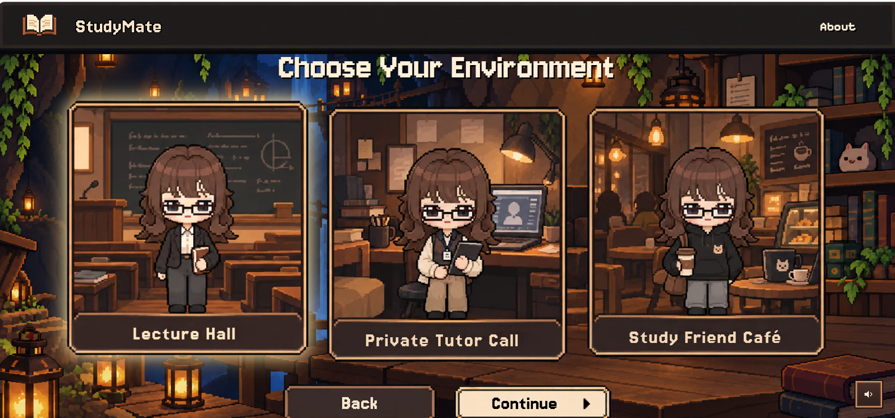
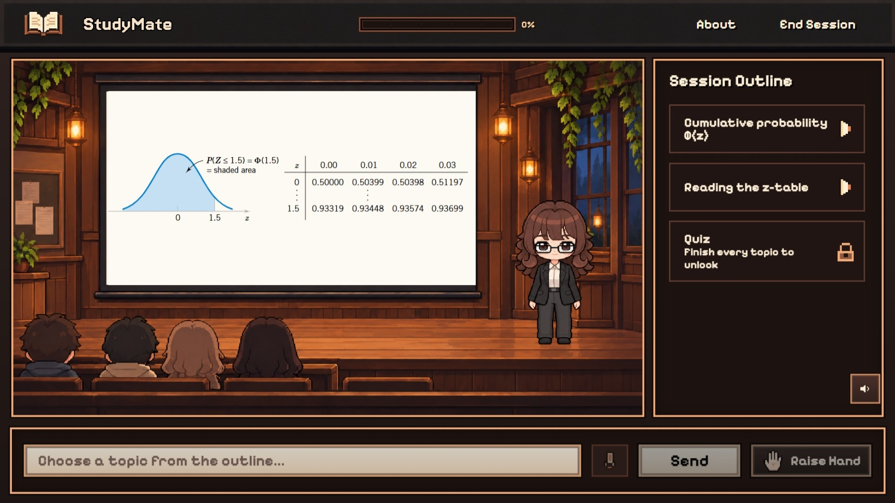
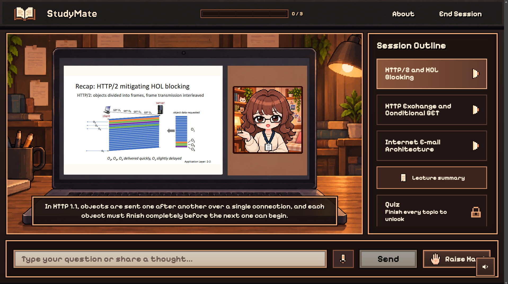
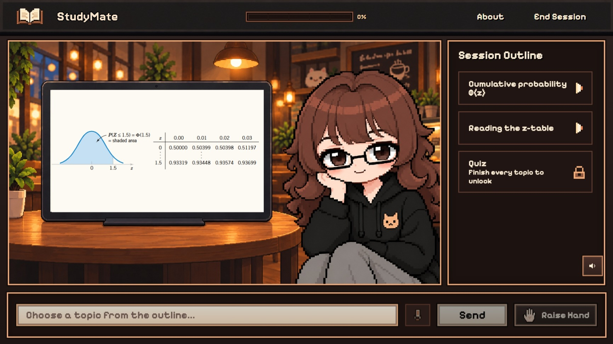

# StudyMate

**Your lecture slides, brought to life.** StudyMate turns lecture PDFs into interactive AI-taught lessons that explain, ask, listen, and adapt to what students find difficult.

## Why StudyMate?

Lecture slides often contain diagrams, formulas, and brief bullet points that make sense *with a professor*, but not always alone. Students who miss class or prefer independent study are left searching YouTube for videos that don't match their lecture, or uploading their slides to an AI chatbot and repeatedly prompting it to explain, continue, or get back on track.

**StudyMate makes the lecture itself teachable.** Instead of leaving students to manage a chat, it guides them through their own material in a structured, interactive session.

## The Experience

1. **Upload a PDF.** StudyMate reads slide text and interprets meaningful diagrams and visual content.
2. **Follow a lesson plan.** AI reorganizes the lecture into a logical, slide-grounded topic outline.
3. **Choose your teacher.** Study in a **Lecture Hall**, with a **Private Tutor**, or at a **Study Café**, three expressive on-screen characters with different teaching styles.
4. **Learn actively.** Hear explanations with synchronized slides and subtitles. Answer conceptual questions by typing or recording your voice, receive feedback and hints, and retry when needed.
5. **Stay in control.** Raise your hand to interrupt, ask a question, and resume where you left off; replay topics with fresh explanations.
6. **Practice what matters.** A final adaptive quiz revisits weak concepts identified from your answers during the session.

## Screenshots

### Home

<p align="center">
  <a href="screenshots/homepage.png">
    
  </a>
</p>

### Getting Started

| Upload Your Lecture | Choose Your Environment |
|:---:|:---:|
| <a href="screenshots/uploadpage.png"></a> | <a href="screenshots/chooseenviromentpage.png"></a> |

### Learning Environments

| Lecture Hall | Private Tutor | Study Café |
|:---:|:---:|:---:|
| <a href="screenshots/lecturehallpage.png"></a> | <a href="screenshots/privatetutorpage.png"></a> | <a href="screenshots/cafepage.png"></a> |

*Click any screenshot to view it at full size.*

## Demo Video

<!-- Replace this placeholder with the public demo link when it is ready.
     Example: [Watch the StudyMate demo](https://youtu.be/YOUR_VIDEO_ID) -->

*Demo video coming soon.*

## How It Works

StudyMate uses **PyMuPDF** and **Featherless AI** to interpret slide text and visuals, then generates a slide-grounded lesson plan. **LangGraph** orchestrates the session: teaching, questioning, evaluating answers, handling interruptions, and tracking weak areas. **React**, **PDF.js**, **Fish Audio**, and **Groq Whisper** bring that workflow into an interactive classroom.

Students can also record an answer or question. **Groq Whisper** transcribes it with lecture context, then places the editable transcript in the normal text field before the student sends it. If voice input is unavailable, typing remains available.

### Agent Workflow

<!-- Replace this placeholder with the final workflow image, for example:
     
     Add the image file to the repository and update the path accordingly. -->

*Detailed agent workflow diagram coming soon.*

**The AI is more than a wrapper:** Featherless AI processes visual slides and generates teaching content; Pydantic checks structured outputs; and LangGraph maintains the state of each lesson—topic, slide, spoken segment, questions, progress, and weak areas—so student interruptions don't derail the experience.

**Tech stack:** React, JavaScript, HTML, CSS, Vite, PDF.js · Python, FastAPI, LangGraph, Pydantic, PyMuPDF, HTTPX · Featherless AI · Fish Audio · Groq Whisper.

## Run Locally

**Requirements:** Python, Node.js/npm, a Featherless AI API key, and a Fish Audio API key. A Groq API key is optional but required for voice answers.

### 1. Clone

```bash
git clone https://github.com/bushramagdy3/StudyMate.git
cd StudyMate
```

### 2. Backend

```bash
cd backend
python -m venv venv
```

Activate the virtual environment:

- Windows: `venv\Scripts\activate`
- macOS/Linux: `source venv/bin/activate`

Then:

```bash
pip install -r requirements.txt
```

Create `backend/.env` with the required teaching and speech keys, plus the optional voice-transcription key:

```env
FEATHERLESS_API_KEY=your_featherless_api_key
FISH_AUDIO_API_KEY=your_fish_audio_api_key
GROQ_STT_API_KEY=your_groq_api_key
```

OR in the terminal:

```bash
@"
FEATHERLESS_API_KEY=your_featherless_key
FISH_AUDIO_API_KEY=your_fish_audio_key
GROQ_STT_API_KEY=your_groq_api_key
"@ | Set-Content -Path .env -Encoding ascii
```

Start the backend (from `backend/`):

```bash
uvicorn main:app --reload
```

### 3. Frontend

If you don't have Node.js Installed, then in the terminal, install Node.js:
```bash
winget install OpenJS.NodeJS.LTS
```

Then, close and reopen VS Code and in a **new terminal**, from the project root:

```bash
cd StudyMate
cd frontend
npm install
npm run dev
```

Open the local URL Vite prints (usually `http://localhost:5173`). The frontend connects to the backend at `http://127.0.0.1:8000` by default.

### API Availability

The project requires working Featherless AI and Fish Audio keys. Fish Audio's current `s2.1-pro-free` model is advertised as free **through November 30, 2026**; after that, access or the integration may need updating. See [Fish Audio's announcement](https://beta.fish.audio/blog/s2-1-pro-free-api/). Voice answers additionally use Groq Whisper when `GROQ_STT_API_KEY` is configured; the rest of the study session works normally without it.

## What's Next

Persistent student learning histories to adapt teaching across lectures, plus more study environments, voices, characters, and finer-grained personalization.

---

*Submitted to ForgeHacks 2026 · AI + Education.*
