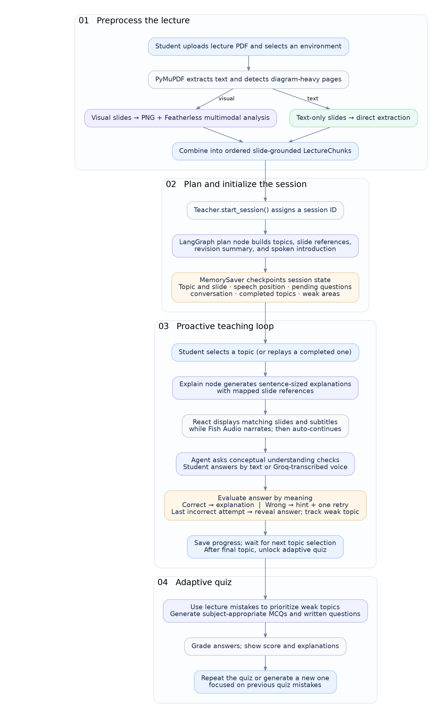

# StudyMate

**Your lecture slides, brought to life.** StudyMate turns lecture PDFs into interactive AI-taught lessons that explain, ask, listen, and adapt to what students find difficult.

## Why StudyMate?

Lecture slides often contain diagrams, formulas, and brief bullet points that make sense *with a professor*, but not always alone. Students who miss class or prefer independent study are left searching YouTube for videos that don't match their lecture, or uploading their slides to an AI chatbot and repeatedly prompting it to explain, continue, or get back on track.

**StudyMate makes the lecture itself teachable.** Instead of leaving students to manage a chat, it guides them through their own material in a structured, interactive session.

## The Experience

1. **Upload a PDF.** StudyMate reads slide text and interprets meaningful diagrams and visual content.
2. **Follow a lesson plan.** AI reorganizes the lecture into a logical, slide-grounded topic outline.
3. **Choose your teacher.** Study in a **Lecture Hall**, with a **Private Tutor**, or at a **Study Café**, three expressive on-screen characters with different teaching styles.
4. **Learn actively.** Hear explanations with synchronized slides and subtitles. Answer conceptual questions by typing or recording your voice, receive feedback and hints, and retry when needed.
5. **Stay in control.** Raise your hand to interrupt, ask a question, and resume where you left off; replay topics with fresh explanations.
6. **Practice what matters.** A final adaptive quiz revisits weak concepts identified from your answers during the session.

## Screenshots

### Home

<p align="center">
  <a href="screenshots/homepage.png">
    
  </a>
</p>

### Getting Started

| Upload Your Lecture | Choose Your Environment |
|:---:|:---:|
| <a href="screenshots/uploadpage.png"></a> | <a href="screenshots/chooseenviromentpage.png"></a> |

### Learning Environments

| Lecture Hall | Private Tutor | Study Café |
|:---:|:---:|:---:|
| <a href="screenshots/lecturehallpage.png"></a> | <a href="screenshots/privatetutorpage.png"></a> | <a href="screenshots/cafepage.png"></a> |

*Click any screenshot to view it at full size.*

## How It Works

StudyMate uses **PyMuPDF** and **Featherless AI** to interpret slide text and visuals, then generates a slide-grounded lesson plan. **LangGraph** orchestrates the session: teaching, questioning, evaluating answers, handling interruptions, and tracking weak areas. **React**, **PDF.js**, **Fish Audio**, and **Groq Whisper** bring that workflow into an interactive classroom.

Students can also record an answer or question. **Groq Whisper** transcribes it with lecture context, then places the editable transcript in the normal text field before the student sends it. If voice input is unavailable, typing remains available.

### Agent Workflow





**The AI is more than a wrapper:** Featherless AI processes visual slides and generates teaching content; Pydantic checks structured outputs; and LangGraph maintains the state of each lesson—topic, slide, spoken segment, questions, progress, and weak areas—so student interruptions don't derail the experience.

**Tech stack:** React, JavaScript, HTML, CSS, Vite, PDF.js · Python, FastAPI, LangGraph, Pydantic, PyMuPDF, HTTPX · Featherless AI · Fish Audio · Groq Whisper.

## Run Locally

**Requirements:** Python, Node.js/npm, a Featherless AI API key, and a Fish Audio API key. A Groq API key is optional but required for voice answers.

### 1. Clone

```bash
git clone https://github.com/bushramagdy3/StudyMate.git
cd StudyMate
```

### 2. Backend

```bash
cd backend
python -m venv venv
```

Activate the virtual environment:

- Windows: `venv\Scripts\activate`
- macOS/Linux: `source venv/bin/activate`

Then:

```bash
pip install -r requirements.txt
```

Create `backend/.env` with the required teaching and speech keys, plus the optional voice-transcription key:

```env
FEATHERLESS_API_KEY=your_featherless_api_key
FISH_AUDIO_API_KEY=your_fish_audio_api_key
GROQ_STT_API_KEY=your_groq_api_key
```

OR in the terminal:

```bash
@"
FEATHERLESS_API_KEY=your_featherless_key
FISH_AUDIO_API_KEY=your_fish_audio_key
GROQ_STT_API_KEY=your_groq_api_key
"@ | Set-Content -Path .env -Encoding ascii
```

Start the backend (from `backend/`):

```bash
uvicorn main:app --reload
```


### 3. Frontend

**Requirements:** Node.js and npm.

If Node.js is not installed, download it from [nodejs.org](https://nodejs.org/).

On Windows, you can alternatively install it using:

```bash
winget install OpenJS.NodeJS.LTS
```

After installation, restart your terminal.

Open a **new terminal in the StudyMate project root**, then run:

```bash
cd frontend
npm install
npm run dev
```

Open the local URL Vite prints (usually `http://localhost:5173`).

The frontend connects to the backend at `http://127.0.0.1:8000` by default.

### API Availability

The project requires working Featherless AI and Fish Audio keys. Fish Audio's current `s2.1-pro-free` model is advertised as free **through November 30, 2026**; after that, access or the integration may need updating. See [Fish Audio's announcement](https://beta.fish.audio/blog/s2-1-pro-free-api/). Voice answers additionally use Groq Whisper when `GROQ_STT_API_KEY` is configured; the rest of the study session works normally without it.

### Inspiration

**What makes a lecture effective isn't just what the professor explains. It's how they teach.**

A professor moves between slides, connects concepts, asks questions, revisits earlier material when students are confused, and somehow keeps the entire lecture moving.

But lecture slides alone can't recreate that experience.

As a student, I experienced the frustration of missing lectures or trying to study independently. YouTube videos rarely match your actual course material, while AI chatbots and chat-with-PDF platforms leave you responsible for directing the lesson: asking for explanations, requesting questions, reminding the AI where you stopped, and piecing everything together yourself.

I kept wondering: **What if AI could recreate the structure, continuity, and interaction of a real lecture, not just explain its slides?**

That's why we built StudyMate.

### What it does

**StudyMate transforms static lecture PDFs into stateful, interactive teaching experiences.**

Rather than simply answering prompts, its AI agent actively leads the lesson—organizing concepts, explaining them aloud, and synchronizing the relevant PDF slides with speech, subtitles, and an expressive virtual teacher.

The agent follows a structured **teach → question → evaluate → feedback** workflow. Understanding checks aren't optional suggestions: students must engage with the questions, receiving hints and a limited number of attempts before the tutor reveals and explains the answer. Learning becomes active rather than passive.

Just like in a real classroom, students can **raise their hand mid-explanation**, ask about something they missed, even from an earlier slide, and receive a contextual answer before the lecture resumes where it stopped.

Behind the scenes, LangGraph maintains the lesson's state: the current topic, slide, speech position, conversation history, completed topics, and learning difficulties. Students can also replay topics with entirely new explanations.

After the lecture, an **adaptive quiz** prioritizes weaker concepts, selects suitable question formats, and supports new attempts focused on previous mistakes.

With three distinct learning environments, **Lecture Hall, Private Tutor, and Study Café**, StudyMate makes the experience feel less like using a chatbot and more like attending a lecture built around you.

**The student doesn't have to guide the AI through the lecture. The AI guides the student toward understanding.**

### How we built it

**PyMuPDF** extracts slide content and detects pages that need visual interpretation; **Featherless AI** processes diagrams and visual concepts, then helps generate lesson plans, explanations, and understanding checks. **Pydantic** validates structured AI responses.

At the center is **LangGraph**: an interruptible, stateful teaching agent that coordinates planning, explaining, questioning, grading, feedback, topic navigation, and hand-raise interruptions while tracking what each student struggles with during the session.

**FastAPI** powers the backend, **React + Vite + PDF.js** provide the interactive classroom and synchronized slides, **Fish Audio** produces expressive speech, and **Groq Whisper** enables optional voice input.

### Challenges we ran into

The real challenge wasn't making AI explain a slidem it was making it behave like **one continuous teacher**. Questions, interruptions, slide changes, speech playback, and answer evaluation all needed to stay synchronized. We addressed that with explicit LangGraph states, checkpointed session context, segment-aware playback, and event-driven transitions. The quiz also required translating student mistakes into meaningful targeted practice rather than random revision questions.

### Accomplishments that we're proud of

We built a complete **teach → question → feedback → practice** experience around students' *actual course material*. StudyMate goes beyond a PDF summarizer or chat interface: it turns static slides into an interactive lesson with three learning environments, natural interruptions, voice input, and adaptive assessment.

### What we learned

A useful educational agent needs more than good answers. **It needs pedagogical structure, continuity, and feedback**, and an interface that makes students feel guided rather than responsible for prompting every next step.

### What's Next

**A great professor doesn't forget what happened in the previous lecture. Why should an AI tutor?**

Our vision is to evolve StudyMate from an interactive lecture experience into a **continuous, personalized learning companion** that remembers a student's entire academic journey.

Students will be able to organize lecture PDFs into courses, allowing their AI tutor to connect new concepts to previous lectures, remember what they've already studied, and build on earlier knowledge instead of starting from scratch every session.

StudyMate will also track academic progress beyond lectures, including quiz grades, incorrect answers, and difficulties with practice assignments, to develop a deeper understanding of each student's strengths and weaknesses.

The agent will support different learning modes, from **teaching lectures to guiding students through worksheets and practice problems**, while maintaining shared learning context across them.

Combined with more customizable voices, characters, personalities, and environments, our goal is to create something closer to a real professor: **one who knows your course, remembers your progress, understands where you struggle, and grows with you throughout your education.**

---

*Submitted to ForgeHacks 2026 · AI + Education.*
